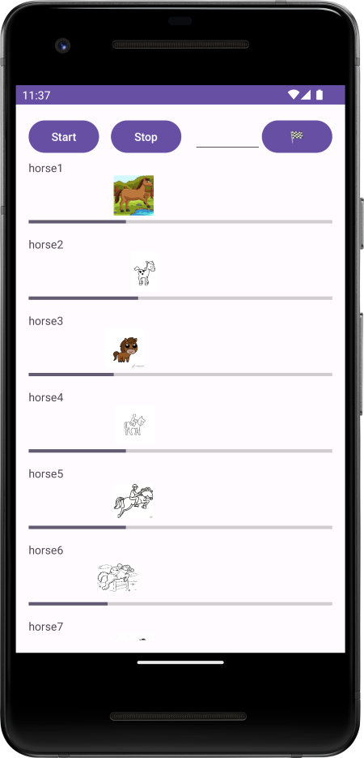

# Práctica de Threads en Java con Android Studio

Esta práctica tiene como objetivo demostrar el uso de threads en una aplicación Android desarrollada en Android Studio. Se implementará una simulación de carrera de caballos donde se aplicarán conceptos de concurrencia y threads.

## Funcionalidades Implementadas

1. **Visualización de 10 Caballos**: La aplicación muestra 10 caballos en una simulación de carrera.

2. **Botón de Detención General**: Se ha implementado un botón que detiene a todos los caballos en su lugar.

3. **Porcentaje Avanzado**: Se muestra el porcentaje de avance de cada caballo durante la carrera.

4. **Imágenes de Caballos**: Cada caballo está representado por una imagen de carrera.

5. **Detención Individual por Número**: Se ha añadido un campo de entrada de número de caballo y un botón que detiene al caballo correspondiente al número ingresado.

6. **Asignación de Nombres**: Cada caballo tiene un nombre asignado.

7. **Caballo Ganador**: Al finalizar la carrera, se muestra el nombre del caballo ganador.

## Uso de Threads

La funcionalidad de la simulación de carrera de caballos se logra mediante el uso de threads en Java. Cada caballo se ejecuta en su propio thread, lo que permite simular el avance independiente de cada uno en la carrera.

## Estructura del Repositorio

- `app/src/main/java/com/example/horse_race/`: Contiene los archivos fuente de la aplicación.
- `app/src/main/res/`: Contiene recursos como las imágenes de los caballos.
- `app/build.gradle`: Archivo de configuración del proyecto Android.

## Capturas de Pantalla

*En esta captura de pantalla, puedes observar los siguientes componentes:*

- `ScrollView`: Un contenedor que permite desplazar el contenido si no cabe en la pantalla.
    - `LinearLayout` (ID: `horsesLayout`): Un diseño lineal vertical que contiene todos los componentes en la pantalla.
        - `LinearLayout`: Un diseño lineal horizontal que contiene botones y un campo de entrada.
            - `Button` (ID: `startRaceButton`): Un botón para iniciar la carrera de caballos.
            - `Button` (ID: `stopRaceButton`): Un botón para detener la carrera de caballos.
            - `EditText` (ID: `editTextNumber`): Un campo de entrada para ingresar el número de caballo a detener.
            - `Button`: Un botón con un emoji de bandera de llegada, que se utiliza para mostrar las posiciones actuales de los caballos (utiliza un atributo `android:onClick` para vincular una función de manejo de clics).

La disposición de los componentes está diseñada para facilitar la interacción y control del usuario sobre la simulación de carrera de caballos. Esta pantalla permite iniciar y detener la carrera, ingresar un número de caballo para detenerlo y mostrar las posiciones actuales de los caballos.

## Requisitos

- Android Studio 4.x o superior.
- Dispositivo Android o emulador compatible.

## Instrucciones de Ejecución

1. Clona este repositorio en tu máquina local.
2. Abre el proyecto en Android Studio.
3. Ejecuta la aplicación en un dispositivo Android o emulador.
4. Sigue las instrucciones en pantalla para interactuar con la simulación de la carrera de caballos.

